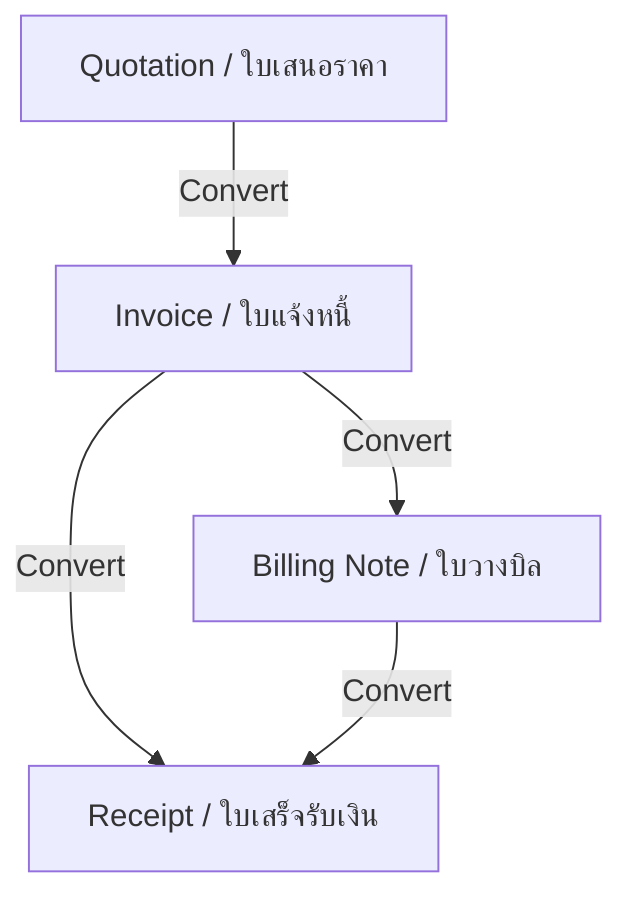

# Project Context: BlessMe Topping Quotation App

This document outlines the business context, domain logic, and architectural rules for the **BlessMe Topping Quotation App**.

---

## 🎯 Business Domain & Purpose
**BlessMe Topping Co., Ltd.** distributes beverage toppings (such as Popping Boba, Jellies, and Cheese toppings). The software is a customized internal document management system designed to streamline their commercial workflow, track inventory, and generate billing documents.

### Key Goals:
1. **Reduce Overhead**: Automatically transition documents through the business lifecycle in a single click.
2. **Ensure Financial Integrity**: Re-calculate all line items and grand totals on the server-side to prevent tampering or client-side calculation discrepancies.
3. **Professional Bilingual Presentation**: All client-facing documents (PDFs and printouts) must present cleanly in both **Thai** (primary) and **English** (secondary) using the **Sarabun** font.

---

## 🔄 Document Lifecycle Flow
The document lifecycle operates as a unidirectional state transition system:

### Conversion Logic rules:
* **Quotation ➡️ Invoice**: Generates an invoice containing all line items. Quotation status upgrades to `ACCEPTED`.
* **Invoice ➡️ Billing Note**: Groups outstanding invoices into a billing note.
* **Invoice/Billing Note ➡️ Receipt**: Records client payment and generates a bilingual receipt. Receipt status marks the invoice as `PAID` and billing note as `COLLECTED`.

---

## 👥 Roles & Access Control
Authentication is handled via **NextAuth.js v5** with two defined roles:

1. **ADMIN**: 
   - Full read/write access to all clients, products, settings, and documents.
   - Able to see, edit, and save inventory details directly in the product stock grid.
   - Full visibility of all transactions in the system.
2. **SALES**:
   - Access is restricted to their own created documents (`createdById` ownership guard).
   - Read-only access to the products stock grid (cannot perform edits).
   - Restricted client management access.

---

## ⚡ Key Business Logic Rules

### 1. Smart Pricing & Markup ("Cheese Rules")
* **Standard Pricing Structure**: Standard items support a 7-tier price structure (115, 100, 90, 80, 75, 70, 65 THB) based on sales volume.
* **Cheese Markup Logic**: If a product name contains the word `"Cheese"` (case-insensitive), the app automatically applies a **+30 THB markup** to all pricing tiers (e.g. 115 THB becomes 145 THB).

### 2. Inventory & Stock Grid Layout
* The system merges reference-image matching stock grids directly into the products management page:
  - Tracks: `แปะแล้ว` (Labelled), `แกะแล้ว` (Unlabelled/Open), `ฉลากจีน` (Chinese Label), `แพ็ค 1/2/3 ถุง` (Packs), and `รวม` (Totals).
  - **Red Line Alerts**: Dashboard displays immediate warnings when stock levels drop below the defined `lowStockThreshold`.

### 3. PDF Generation Architecture
* **createElement Migration**: Next.js App Router using Turbopack requires `@react-pdf/renderer` elements to be constructed programmatically using `React.createElement` instead of raw JSX to prevent multi-child text render clipping on Vercel.
* **Text Safeguards**: Thai glyphs clipping prevention is enforced by adding a trailing space buffer/padding to text components.
* **Numerals**: Arabic numerals (latn) are strictly enforced in all currency and code strings.
